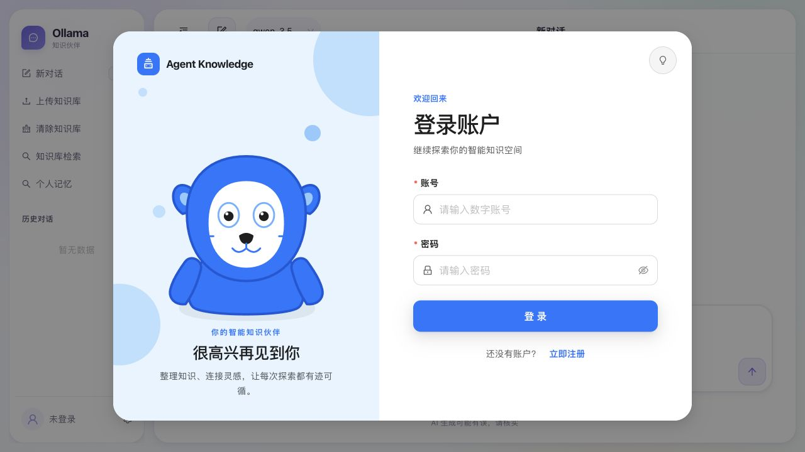

# Agent Knowledge

一个面向个人知识管理场景的智能体应用。项目提供流式 AI 对话、知识库检索、长期记忆、联网搜索、文件理解与产物生成等能力，并内置本地 Ollama 模型及多种兼容 OpenAI API 的模型配置。

## 界面预览



## 功能特性

- **多模型对话**：支持 Ollama 本地模型、通义千问、DeepSeek 和 OpenAI API。
- **流式响应**：基于 SSE 实时返回回答、思考过程、执行节点和生成产物。
- **知识库问答**：使用 Ollama Embeddings 与 Chroma 构建本地向量知识库。
- **多格式文档解析**：支持 PDF、Word、Excel、PowerPoint、OFD、Markdown、HTML、文本及常见图片格式。
- **OCR 识别**：扫描版 PDF 和图片可通过通义千问 OCR 提取内容。
- **长期记忆**：可接入 Memos 服务，按用户管理、检索和订正记忆。
- **联网搜索**：通过 Tavily 为智能体补充实时信息。
- **技能系统**：可通过 `SKILL.md` 扩展搜索、文件读取、图表可视化和文档生成能力。
- **文件与知识库管理**：文件上传至阿里云 OSS 后，可用于对话附件或写入知识库。
- **用户与会话管理**：支持注册登录、个人资料、历史会话和密码修改。

## 技术栈

| 层级 | 技术 |
| --- | --- |
| 前端 | Vue 3、TypeScript、Vite、Pinia、Ant Design Vue |
| 后端 | FastAPI、SQLAlchemy、PyMySQL |
| 模型调用 | OpenAI SDK、Ollama、LangChain |
| 向量检索 | Chroma、Ollama Embeddings |
| 文档处理 | python-docx、openpyxl、python-pptx、pypdf、pypdfium2、easyofd |
| 外部服务 | 阿里云 OSS、Tavily、Memos |

## 项目结构

```text
agent-knowledge/
├── web/                         # Vue 前端
│   ├── src/
│   │   ├── components/          # 通用组件
│   │   ├── services/            # HTTP 与对话服务
│   │   ├── stores/              # Pinia 状态管理
│   │   ├── utils/               # SSE、文件及对话工具
│   │   └── views/               # 对话、知识库、记忆和历史页面
│   └── package.json
├── python/                      # FastAPI 后端
│   ├── agent/                   # 智能体编排与历史上下文
│   ├── config/                  # 数据库配置
│   ├── db/                      # 数据库连接与初始化
│   ├── models/                  # 数据模型
│   ├── routers/                 # API 路由
│   ├── services/                # 业务服务
│   ├── skills/                  # 内置智能体技能
│   ├── tests/                   # 后端测试
│   ├── main.py                  # 后端入口
│   └── requirements.txt
└── README.md
```

## 环境要求

- Python 3.10+
- Node.js `^20.19.0`、`^22.13.0` 或 `>=24`
- MySQL 8.x
- Ollama
- LibreOffice（解析 `.doc`、`.xls`、`.ppt` 时需要）

默认知识库嵌入模型为 `qwen3-embedding:4b`，默认本地对话模型为 `qwen3.5:9b`。请先安装 Ollama，并按需拉取模型：

```bash
ollama pull qwen3-embedding:4b
ollama pull qwen3.5:9b
```

项目也预置了 `deepseek-r1:8b` 和 `x/flux2-klein:4b`，只有使用相应智能体时才需要拉取。

## 快速开始

### 1. 创建数据库

在 MySQL 中创建两个数据库：

```sql
CREATE DATABASE `agent-knowledge`
  CHARACTER SET utf8mb4
  COLLATE utf8mb4_unicode_ci;

CREATE DATABASE `agent-user`
  CHARACTER SET utf8mb4
  COLLATE utf8mb4_unicode_ci;
```

然后根据本地环境修改 [`python/config/db_config.py`](python/config/db_config.py) 中的主机、账号和密码。后端启动时会自动创建数据表并写入默认智能体配置。

> 当前数据库配置直接保存在 Python 文件中，仅适合本地开发。生产部署时建议改为从环境变量或密钥管理服务读取。

### 2. 安装并启动后端

```bash
cd python

python3 -m venv .venv
source .venv/bin/activate
pip install -r requirements.txt

cp .env-example .env
```

按实际使用的功能编辑 `python/.env`。本地 Ollama 对话不要求配置云端模型密钥，但文件上传、联网搜索、OCR、记忆等功能需要对应配置。

```dotenv
# 云端模型（按需配置）
QWEN_API_KEY=
DEEPSEEK_API_KEY=
OPENAI_API_KEY=

# 联网搜索
TAVILY_API_KEY=

# 阿里云 OSS
OSS_ACCESS_KEY_ID=
OSS_ACCESS_KEY_SECRET=
OSS_ENDPOINT=
OSS_BUCKET_NAME=

# 长期记忆
MEMOS_API_KEY=
MEMOS_BASE_URL=https://memos.memtensor.cn/api/openmem/v1

# 模型最大输出长度
MAX_TOKENS=8192

# OCR
QWEN_OCR_BASE_URL=https://your-ocr-compatible-api.example.com/v1
QWEN_OCR_MODEL=qwen3.5-ocr
OCR_TIMEOUT_SECONDS=45
OCR_MAX_RETRIES=1
OCR_MAX_IMAGE_DIMENSION=2400
OCR_JPEG_QUALITY=88
PDF_OCR_MIN_TEXT_CHARS=20
PDF_OCR_DPI=180

# 知识库
KNOWLEDGE_EMBEDDING_MODEL=qwen3-embedding:4b
```

启动后端：

```bash
python main.py
```

服务默认运行在 <http://127.0.0.1:8000>，接口文档位于 <http://127.0.0.1:8000/docs>。

### 3. 安装并启动前端

新开一个终端：

```bash
cd web
npm ci
npm run dev
```

访问 <http://127.0.0.1:5173>。开发服务器已将 `/auth`、`/agent` 和 `/file` 请求代理到 `http://127.0.0.1:8000`。

如果前后端分开部署，可在前端环境文件中配置：

```dotenv
VITE_API_BASE_URL=https://your-api.example.com
```

## 配置项

OCR 与知识库相关变量为必填配置；其他变量可按实际启用的功能调整。

| 变量 | 示例值 | 用途 |
| --- | --- | --- |
| `MAX_TOKENS` | `8192` | 模型最大输出 token 数 |
| `AGENT_SKILLS_DIR` | `python/skills` | 自定义技能目录 |
| `MEMOS_TIMEOUT` | `15` | Memos 请求超时，单位为秒 |
| `MAX_PARSE_FILE_BYTES` | `20971520` | 远程文件最大解析字节数 |
| `FILE_DOWNLOAD_TIMEOUT_SECONDS` | `30` | 文件下载超时，单位为秒 |
| `LIBREOFFICE_BINARY` | 从 `PATH` 查找 | LibreOffice 可执行文件路径 |
| `LIBREOFFICE_TIMEOUT_SECONDS` | `60` | 旧版 Office 转换超时 |
| `PDF_OCR_MIN_TEXT_CHARS` | `20` | PDF 页面触发 OCR 的文本阈值 |
| `PDF_OCR_DPI` | `180` | 扫描 PDF 页面渲染 DPI |
| `QWEN_OCR_BASE_URL` | DashScope 兼容接口 | OCR API 地址 |
| `QWEN_OCR_MODEL` | `qwen3.5-ocr` | OCR 模型名称 |
| `OCR_TIMEOUT_SECONDS` | `45` | 单次 OCR 请求超时 |
| `OCR_MAX_RETRIES` | `1` | OCR 失败重试次数 |
| `OCR_MAX_IMAGE_DIMENSION` | `2400` | OCR 图片最大边长 |
| `OCR_JPEG_QUALITY` | `88` | OCR 图片 JPEG 质量 |
| `KNOWLEDGE_EMBEDDING_MODEL` | `qwen3-embedding:4b` | 知识库使用的 Ollama Embedding 模型 |

更完整的文档处理说明见 [`python/DOCUMENT_PARSING.md`](python/DOCUMENT_PARSING.md)。

## 支持的文件格式

- 图片：JPG、JPEG、PNG、GIF、BMP、WebP、TIFF
- 文档：PDF、DOC、DOCX、XLS、XLSX、TXT、MD、PPT、PPTX、HTML、HTM、OFD

上传限制由后端校验：图片最大 5 MB，其他受支持的文件最大 10 MB。旧版 Office 文件会先通过 LibreOffice 无界面转换，再进入对应解析器。

## 技能扩展

每个技能放在独立目录中，并以 `SKILL.md` 作为入口：

```text
python/skills/
└── my-skill/
    ├── SKILL.md
    └── handler.py               # 可选的执行入口
```

项目目前内置：

- `web-search`：联网搜索
- `knowledge-search`：知识库检索
- `file-reader`：附件读取
- `image-to-document`：图片转文档
- `artifact-generator`：生成可下载文件
- `chart-visualization`：图表可视化

技能元数据、执行器和产物格式的说明见 [`python/skills/README.md`](python/skills/README.md)。

## 常用命令

前端：

```bash
cd web
npm run dev
npm run build
npm run test
npm run lint
npm run format
```

后端：

```bash
cd python
python -m unittest discover -s tests
python main.py
```

## API 概览

| 方法 | 路径 | 说明 |
| --- | --- | --- |
| `GET` | `/` | 健康检查 |
| `POST` | `/auth/register` | 注册用户 |
| `POST` | `/auth/login` | 登录并写入 Cookie |
| `GET` | `/agent/list` | 获取智能体列表 |
| `POST` | `/agent/chat` | SSE 流式对话 |
| `GET` | `/agent/skills` | 获取可用技能 |
| `POST` | `/agent/knowledge` | 检索知识库 |
| `POST` | `/file/upload` | 上传单个文件至 OSS |
| `POST` | `/file/uploads` | 批量上传文件至 OSS |
| `POST` | `/file/knowledge/upload` | 解析文件并写入知识库 |

完整请求参数和响应结构请通过 FastAPI Swagger 页面查看。

## 数据与部署说明

- Chroma 数据默认写入后端运行目录下的 `chroma_db/knowledge`。
- 数据库表在 FastAPI 生命周期启动阶段自动初始化。
- 登录状态通过 HttpOnly Cookie 维护，默认有效期为 30 分钟。
- 当前 CORS、Cookie 安全属性、JWT 密钥和数据库凭据均采用开发配置；生产部署前必须收紧跨域来源、启用 HTTPS，并将敏感配置迁移到环境变量或密钥管理服务。
- OSS、Memos、Tavily 和云端模型均为可选集成，但依赖它们的界面功能需要配置对应服务。

## License
